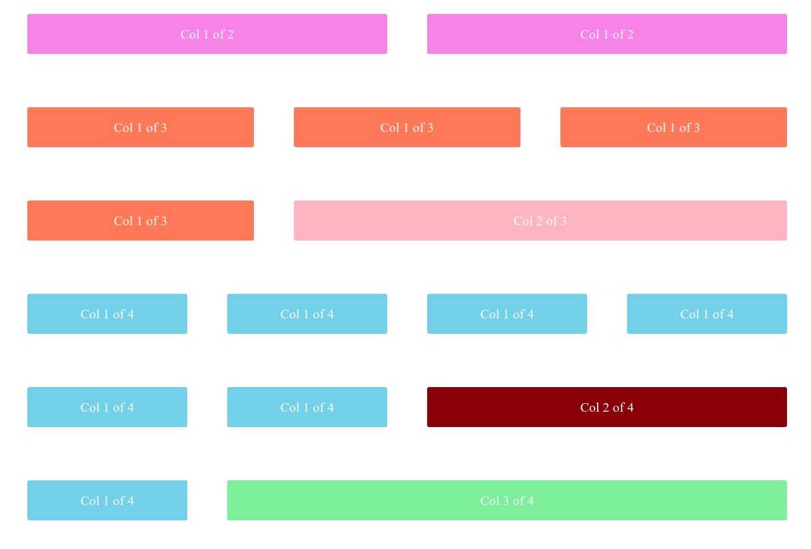

# Make your own grid



### Custom Grid description
- Add other size of columns in `_grid.scss`
- Change gutter sizes in `_variables.scss`
- Make it responsive with media queries in `_mixins.scss`

### To keep playing
```bash
$ git clone https://github.com/rom-30/custom_grid
$ yarn install
$ yarn start
```

### Can be removed
```scss
// sass/_grid.scss

height: 6rem;
justify-content: center;
align-items: center;
display: flex;
```

